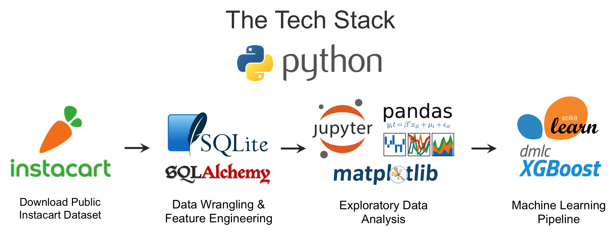

Predicting Behavior of Instacart Shoppers
==========================================

...

------------

Keywords:  Consumer behavior; Machine learning; Gradient boosting; XGBoost

------------

## Table of Contents

[Background](#background)  
[The Dataset](#the-dataset)  
[Process Overview and Tech Stack](#process-overview-and-tech-stack)   
[Results](#results)   
[Final Report](#final-report)   
[GitHub Folder Structure](#github-folder-structure)  
[References](#references)  
[Acknowledgements](#acknowledgements)

------------

------------

------------

This repo contains the documentation for my second capstone project at [Springboard](https://www.springboard.com/workshops/data-science-career-track).  The goal of this capstone project is to use machine learning techniques to predict the consumer behavior of Instacart shoppers.

My analysis is based on “The Instacart Online Grocery Shopping Dataset 2017”, accessed from https://www.instacart.com/datasets/grocery-shopping-2017 on June 25, 2017.  This is an open sourced dataset of 3 million Instacart orders.

------------

## Table of Contents

[Project Organization](#project-organization)  
[Background](#background)  
[Objective](#objective)  
[Process Overview and Flow](#process-overview-and-flow)   
[EDA and Data Mining](#eda-and-data-mining)  
[Method](#method)   
[Measures](#measures)  
[Results](#results)   
[Next Steps](#next-steps)  
[References](#references)  
[Acknowledgements](#acknowledgements)

------------

## Project Organization
------------

------------

## Process Overview and Tech Stack

------------

## Results

......

------------

## Final Report

The final report for the project can be found [here](https://github.com/zkneupper/Instacart-Prediction-Capstone/tree/master/reports/Final_Report.pdf).

------------

## GitHub Folder Structure

    ├── LICENSE
    ├── README.md          <- The top-level README for this project.
    ├── data
    │   ├── interim        <- Intermediate data that has been transformed.
    │   ├── processed      <- The final, canonical data sets for modeling.
    │   └── raw            <- The original, immutable data dump.
    │
    ├── models             <- Trained and serialized models
    │
    ├── notebooks          <- Jupyter notebooks.
    │
    ├── references         <- Dataset descriptions.
    │
    ├── reports            <- Generated analysis as PDF reports and Jupyter notebooks.
    │   └── figures        <- Generated graphics and figures to be used in reporting
    │   └── images    
    │
    └── src                <- Source code for use in this project.
        ├── __init__.py    <- Makes src a Python module
        │  
        ├── data           <- Scripts to download or generate data
        │   └── make_dataset.py
        │
        ├── features       <- Scripts to turn raw data into features for modeling
        │   └── build_features.py
        │
        └── models         <- Scripts to train models and then use trained models to make
            │                 predictions
            ├── predict_model.py
            └── train_model.py

--------

## Background

...

...

...

------------

## References

1. [“The Instacart Online Grocery Shopping Dataset 2017”](https://www.instacart.com/datasets/grocery-shopping-2017), accessed on June 25, 2017.

2. [Instacart Market Basket Analysis](https://www.kaggle.com/c/instacart-market-basket-analysis#description) challenge on www.kaggle.com.

3. ["Instacart Market Basket Analysis, Winner's Interview: 2nd place, Kazuki Onodera"](http://blog.kaggle.com/2017/09/21/instacart-market-basket-analysis-winners-interview-2nd-place-kazuki-onodera/) by Edwin Chen, dated September 21, 2017.

------------

## Acknowledgements

This was one of my capstone projects for the Data Science Career Track program at [Springboard](https://www.springboard.com/workshops/data-science-career-track).  

I would like to thank my mentor Kenneth Gil-Pasquel for his guidance and feedback.  

------------
