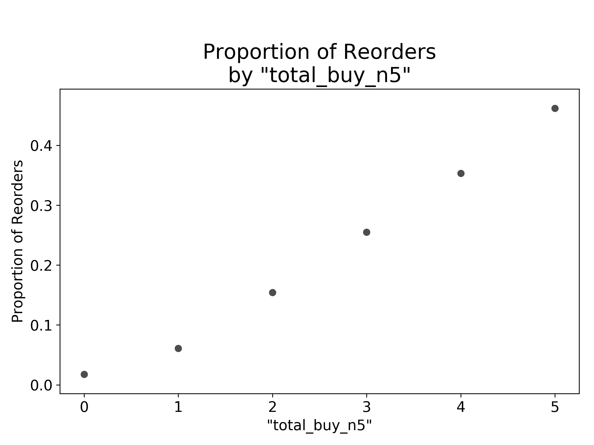
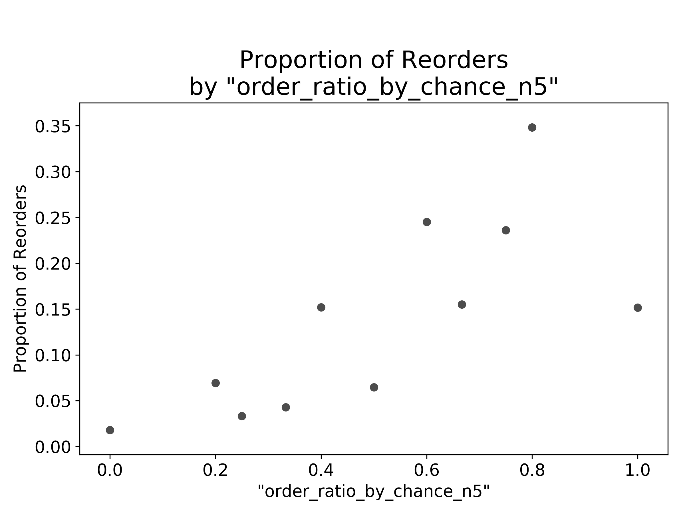
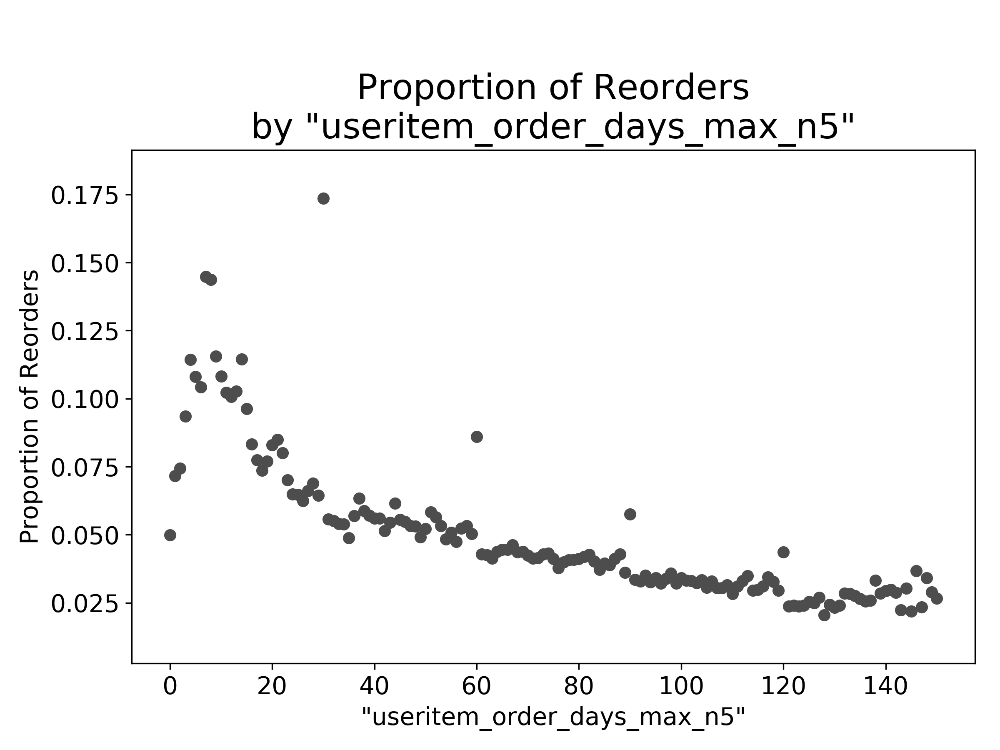
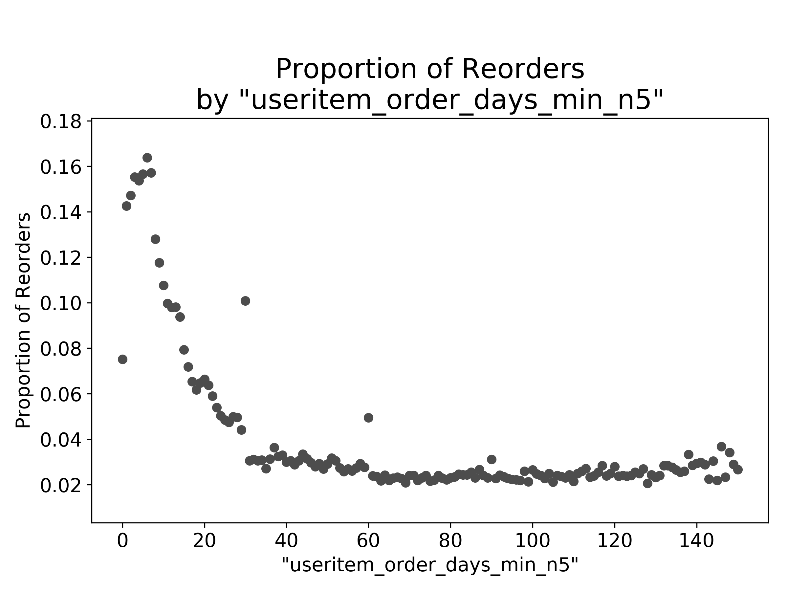
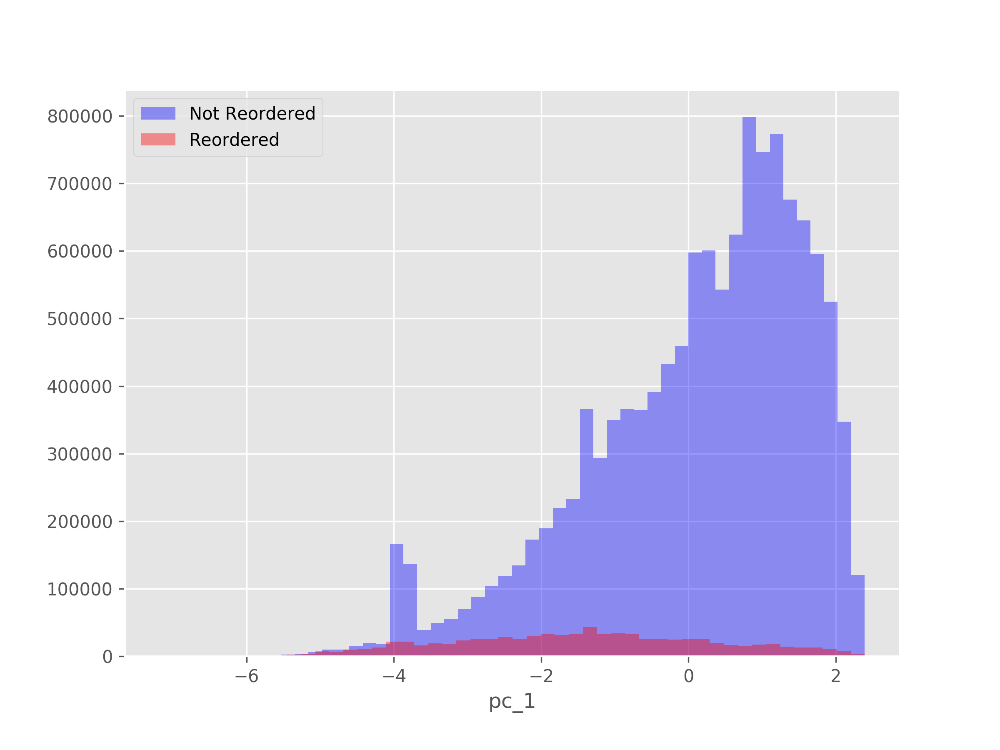
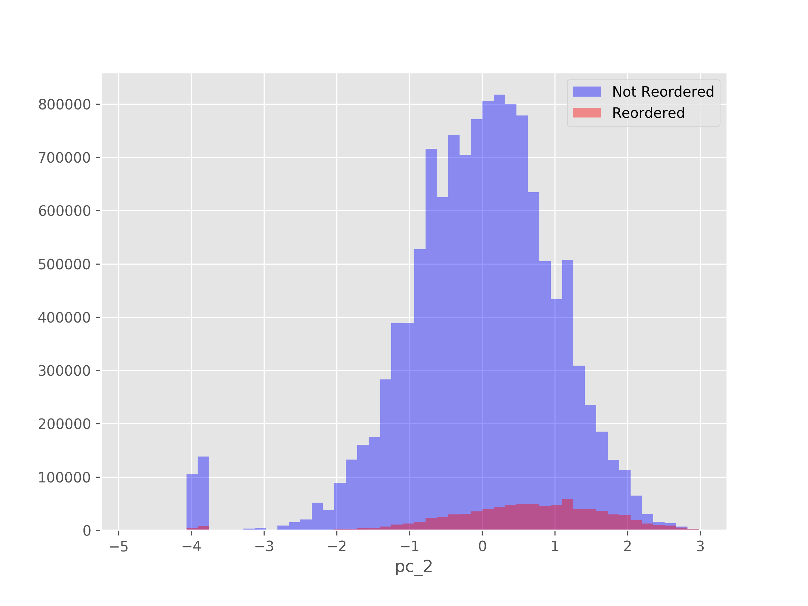
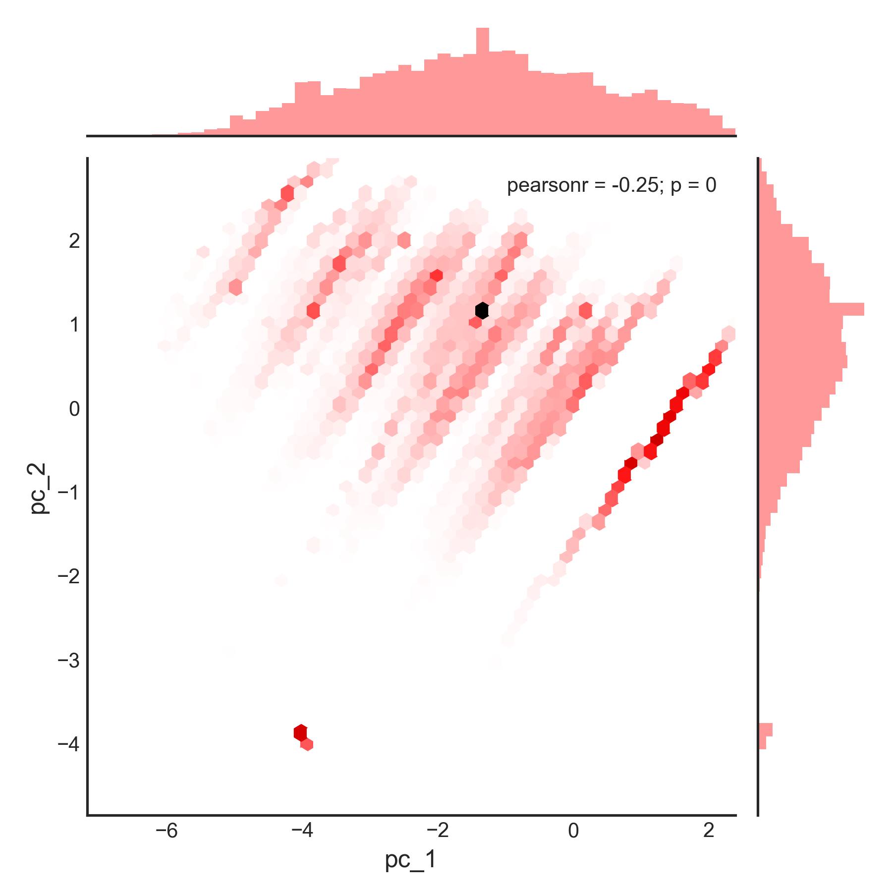
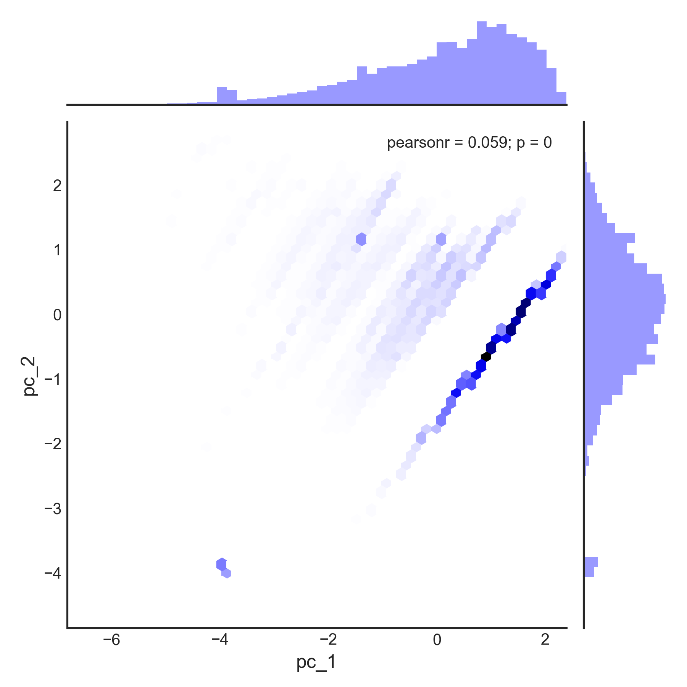

# Milestone Report For Capstone Project 2: Predicting Behavior of Instacart Shoppers

In this Milestone Report, we will do the following:

1. Define the problem;
2. Identify our client;
3. Describe our data set, and how we cleaned/wrangled it;
4. List other potential data sets we could use; and
5. Explain our initial findings.

### 1. Define the problem

The goal of this capstone project is to build a model to predict what grocery items each Instacart user will reorder based on the user's purchase history.

### 2. Identify the client

Our client is Instacart.  With the proposed predictive model, Instacart could provide its users with useful purchase recommendations and improve the app's overall user experience.  This could help Instacart retain current app users and increase the number of purchases through the app.

### 3. Describe our dataset, and how we cleaned/wrangled it;

#### Our Data Source

Last year, Instacart released a public dataset, “The Instacart Online Grocery Shopping Dataset 2017”.  The dataset contains over 3 million anonymized grocery orders from more than 200,000 Instacart users.  We use this dataset in our analysis.  The dataset can be downloaded [here](https://www.instacart.com/datasets/grocery-shopping-2017)

-----------------------------------

#### Data Description

The Instacart dataset contains six tables in `.csv` format:

1. `aisles.csv`
2. `deptartments.csv`
3. `order_products__prior.csv`
4. `order_products__train.csv`
5. `orders.csv`
6. `products.csv`

A more detailed description of these tables is as follows:

`orders` (3.4m rows, 206k users):
* `order_id`: order identifier
* `user_id`: customer identifier
* `eval_set`: which evaluation set this order belongs in (see `SET` described below)
* `order_number`: the order sequence number for this user (1 = first, n = nth)
* `order_dow`: the day of the week the order was placed on
* `order_hour_of_day`: the hour of the day the order was placed on
* `days_since_prior`: days since the last order, capped at 30 (with NAs for `order_number` = 1)

`products` (50k rows):
* `product_id`: product identifier
* `product_name`: name of the product
* `aisle_id`: foreign key
* `department_id`: foreign key

`aisles` (134 rows):
* `aisle_id`: aisle identifier
* `aisle`: the name of the aisle

`deptartments` (21 rows):
* `department_id`: department identifier
* `department`: the name of the department

`order_products__SET` (30m+ rows):
* `order_id`: foreign key
* `product_id`: foreign key
* `add_to_cart_order`: order in which each product was added to cart
* `reordered`: 1 if this product has been ordered by this user in the past, 0 otherwise

where `SET` is one of the four following evaluation sets (`eval_set` in `orders`):
* `"prior"`: orders prior to that users most recent order (~3.2m orders)
* `"train"`: training data supplied to participants (~131k orders)
* `"test"`: test data reserved for machine learning competitions (~75k orders)

(Source: https://gist.github.com/jeremystan/c3b39d947d9b88b3ccff3147dbcf6c6b)

#### Data Wrangling & Feature Engineering

Our first step in wrangling the Instacart dataset was to take the contents of the six  `.csv` files and store them in one SQLite database.

We then used SQL to transform the dataset to create a new table that we could use to train and test our machine learning model.

##### The Index

We created a list of unique pairs of users and products from the `prior` set of orders.  We gave this list the label "`up_pair`" for "user-product pair".  This list list was used as a unique index of our final data table.

##### The Target

We created a binary target variable `y` for whether or not a user reordered a product.

For each unique pair of user and product from the `prior` set of orders, if the user bought the product in the  `prior` set of orders *and* reordered the product in the `train` set of orders, then our target variable `y` is assigned the value 1.  On the other hand, if the user bought the product in the  `prior` set, but they didn't reorder the product in the `train` set, then our target variable `y` is assigned the value 0.

##### The Features

We engineered five explanatory features.  These features are as follows:

Given the user-product pair of (User A, Product B),

1. `total_buy_n5`: the total number of times User A bought Product B out of the 5 most recent orders.

2. `total_buy_ratio_n5`: the proportion of User A's 5 most recent orders in which User A bought Product B.

3. `order_ratio_by_chance_n5`: the proportion of User A's 5 most recent orders in which User A had the "chance" to buy B, and did indeed do so.  Here, a "chance" refers to the number of opportunities the user had for buying the item after first encountering (*viz.*, buying)  it. For example, if a User A bought Product B for the first time in their 4th most recent order, then the user would have had 4 chances to buy the product.  If that user had bought the product only in their 4th and 2nd most recent orders, then `order_ratio_by_chance_n5` would be 0.5 (*i.e., (1+1)/4) for that user-product pair.

4. `useritem_order_days_max_n5`: the longest number of days that User A has recently gone without buying Product B.  We are only considering the 5 most recent orders.

5. `useritem_order_days_min_n5`: the shortest number of days that User A has recently gone without buying Product B.  Again, we are only considering the 5 most recent orders.

The choice of these five features was inspired by [Onodera's solution](http://blog.kaggle.com/2017/09/21/instacart-market-basket-analysis-winners-interview-2nd-place-kazuki-onodera/]), which won 2nd place in the Instacart Kaggle competition.

### 4. List other potential data sets we could use

We did not deem it appropriate or necessary to use any additional sources of data.

### 5. Explain our initial findings

#### The Target is Imbalanced

We found that our target variable `y` is quite imbalanced.  Among all of the "user-product pairs" considered, only about 6% of the samples had reorders.

#### Bivariate Visualizations

We visualized how the proportion of reorders varies with each feature.

First, we plotted the how the proportion of reorders varies with the feature `total_buy_n5`, which is the total number of times User A bought Product B out of the 5 most recent orders.  We found that the proportion of reorders increases linearly with `total_buy_n5`.

Next, we plotted the how the proportion of reorders varies with the feature `order_ratio_by_chance_n5`, which is the proportion of User A's 5 most recent orders in which User A had the "chance" to buy B, and did indeed do so.  We found that the proportion of reorders generally increases with `order_ratio_by_chance_n5`.

We then plotted the how the proportion of reorders varies with  `useritem_order_days_max_n5` and `useritem_order_days_min_n5`, respectively.  We found that the proportion of reorders generally decreases nonlinearly with both of these features.

#### PCA for Data Visualization

In order to better visualize the data, we used principal component analysis to reduce the dimensionality of the feature set.

The plot below shows two overlaid histograms, where the x-axis is the first principal component and the y-axis the number of reorders or non-reorders.  The red histograms is for reorders.  The blue histograms is for non-reorders.  

Below is the same type of plot as above, but here, the x-axis represents the second principal component

From the previous two plots, the two categories do not appear to be easily separable in our feature space.

Additionally, we created two hexbin plots, where the x-axis represents the first principal component and the y-axis represents the second principal component.

The first hexbin plot shows how *reordered* observations are distributed in the feature space.

The second hexbin plot shows how *non-reordered* observations are distributed in the feature space.

Building a classification algorithm for this imbalanced and apparently inseparable dataset may prove challenging.
